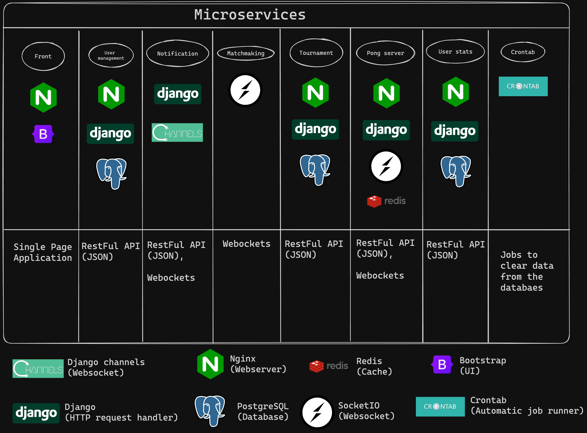
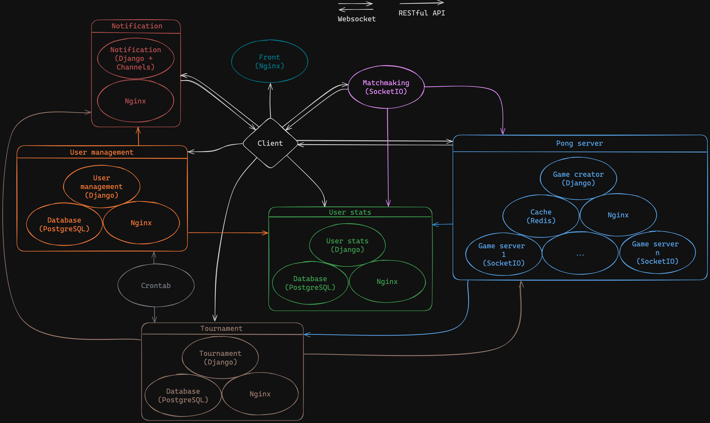
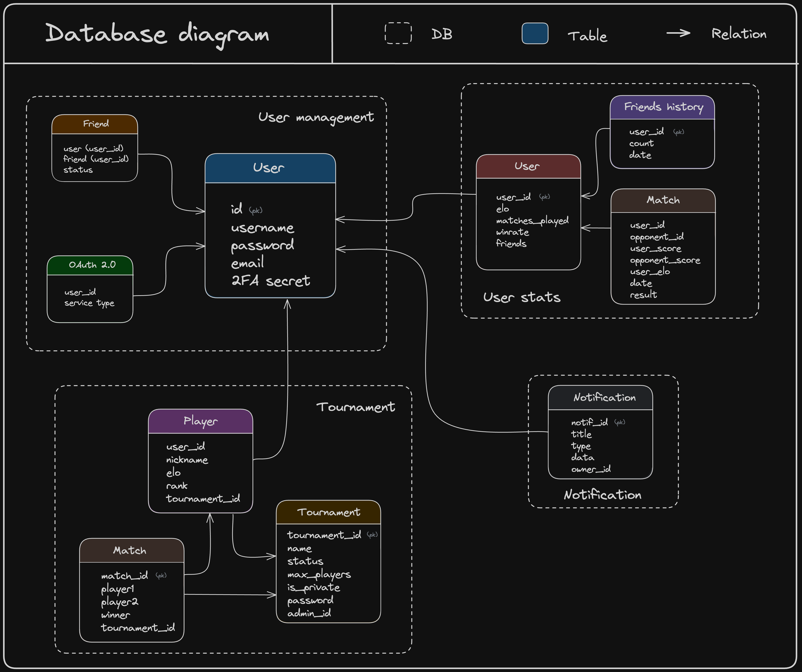

# Transcendence


Transcendence is a project at 42 School aimed at familiarizing us with web development by creating a competitive multiplayer version of Pong.


https://github.com/tdameros/42-transcendence/assets/97832618/af364140-2886-4818-b81b-99d09d70ce3e

## Usage

Install the common dependencies.

```bash
pip3 install -r common/docker/requirements.txt
```

Generate the `.env` file using .env.example as a template.

```bash
cp .env.example .env
```

Generate .env files for each service

```bash
make generate_env
```

Start microservices

```bash
make
```

Open the website at https://localhost/

```bash
open https://localhost/
```

## Features

- Remote player functionality
- Remote authentication capability
- Microservices architecture implementation
- 3D pong game integration
- GDPR compliance
- User and game statistics tracking
- Support for multiple devices
- Tournament feature accommodating up to 32 players
- Ranking system implementation
- Elo-based matchmaking system

## Technologies




## Microservices Architecture



## Databases Architecture



## Default Ports

- Front: 443
- Tournament: 6001
- User management: 6002
- User stats: 6003
- Matchmaking: 6004
- Notification: 6005
- Game creator: 6006
- Game server: 50200:50400

## Documentation

- [General](doc/documentation.md)
- [Front](front/doc/front.md)
- [Matchmaking](matchmaking/doc/matchmaking.md)
- [Game Creator](pong_server/doc/game_creator.md)
- [Game Server](pong_server/doc/game_server.md)
- [Tournament](tournament/doc/tournament.md)
- [User Management](user_management/doc/user_management.md)
- [Notification](notification/doc/notification.md)
